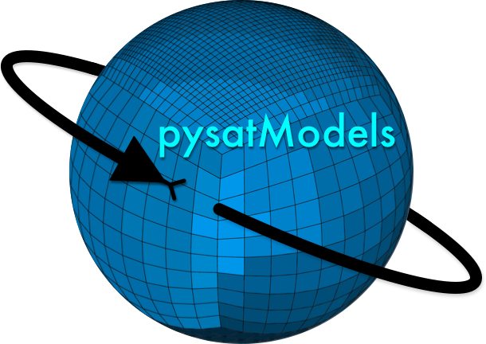

<div align="left">
        
        
</div>

# pysatModels
[](https://pysatmodels.readthedocs.io/en/latest/?badge=latest)
[](https://github.com/pysat/pysatModels/actions/workflows/main.yml/badge.svg)
[](https://coveralls.io/github/pysat/pysatModels?branch=main)
[](https://doi.org/10.5281/zenodo.6567105)
[](https://badge.fury.io/py/pysatModels)

pysatModels handles model-centric data loading through pysat and contains a
variety of tools to perform model-data analysis, including model validation.

Come join us on Slack! An invitation to the pysat workspace is available
in the 'About' section of the
[pysat GitHub Repository.](https://github.com/pysat/pysat)

# Installation

The following instructions will allow you to install pysatModels and give some
examples on how to use the routines

## Prerequisites

pysatModels uses common Python modules, as well as modules developed by and for
the Space Physics community.  This module officially supports Python 3.6+.

|   Common modules   | Community modules  |
| ------------------ | ------------------ |
| numpy              | pyForecastTools    |
| pandas             | pysat >= 3.0.4     |
| requests           | pysatNASA <= 0.0.4 |
| scipy              |                    |
| xarray             |                    |

## Installation through PyPi

```
pip install pysatmodels
```

## Installation from GitHub

1. Clone the git repository:
   `git clone https://github.com/pysat/pysatModels.git`

2. Install pysatModels:
   Change directories into the repository folder and run the setup.py file.
   There are a few ways you can do this:
   A. Install on the system (root privileges required):
      `sudo python3 setup.py install`
   B. Install at the user level:
      `python3 setup.py install --user`
   C. Install with the intent to develop locally:
      `python3 setup.py develop --user`

# Running the code

Examples for using the different pysatModels utilities are included in the
[documentation](https://pysatmodels.readthedocs.io/en/latest/).

If you're unfamiliar with pysat, tutorials and examples are available in its
[documentation](https://pysat.readthedocs.io/en/latest/).
