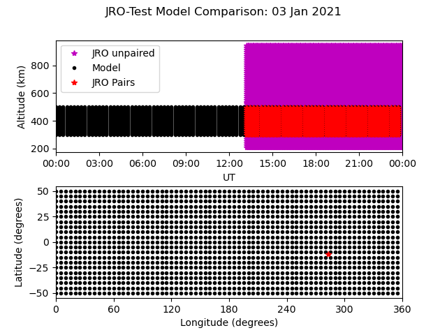
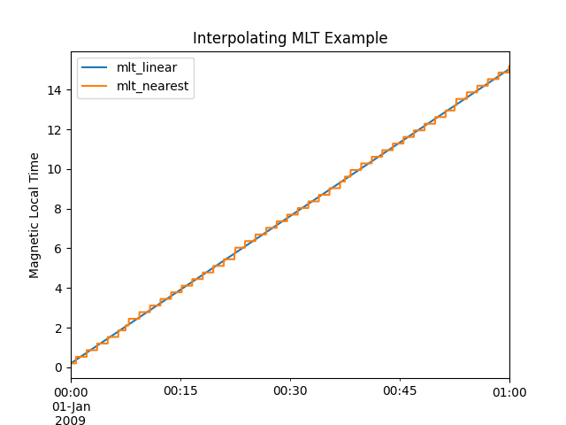
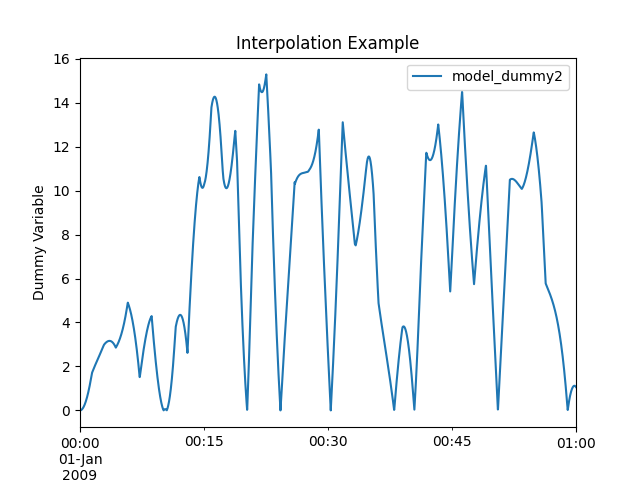
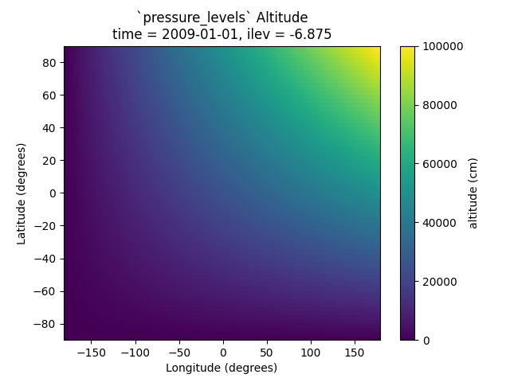

.. _ex_extract:

Extract Observational-Style Data
================================

Comparison of model and Instrument data is supported in pysatModels, in part,
by enabling the extraction (or interpolation) of model output onto the same
locations as an observation-style data set. One common example is
'flying' a satellite through a model. The satellite locations are used
to extract relevant model data enabling direct comparison of observed and
modeled values.

Regular Grid Models
-------------------

:py:func:`pysatModels.utils.extract.extract_modelled_observations` supports
extracting values from models on a regular grid onto observed locations. The
function can linearly interpolate model values onto instrument locations or use
the nearest modeled location. Uses :py:func:`scipy.interpolate.interpn` as the
underlying interpolation function. This function can handle either
:py:mod:`pandas` or :py:mod:`xarray` formatted :py:class:`pysat.Instrument`
observational data.  Because multi-dimensional data can be more complicated,
let's use `Jicamarca ISR drift data <https://pysatmadrigal.readthedocs.io/en/latest/supported_instruments.html#jro-isr>`_ as an example.

.. code:: python

   import datetime as dt
   import pandas as pds
   import pysat
   from pysatMadrigal.instruments import jro_isr
   import pysatModels

   stime = dt.datetime(2021, 1, 3)
   jro = pysat.Instrument(inst_module=jro_isr, tag='drifts', user='Your Name',
                          password='your.email@inst.type')

    # Download data if necessary and then load it
    if stime not in jro.files.files:
        jro.download(start=stime)
    jro.load(date=stime)

    # Get fake model data from the pysat model test instrument
    mod_drange = pds.date_range(stime, stime + dt.timedelta(days=1), freq='1D')
    model = pysat.Instrument('pysat', 'testmodel', tag='',
                             file_date_range=mod_drange)
    model.load(date=stime)

    # Check the loaded variables, you may receive a warning for unknown data variables.
    print(jro.variables, model.variables)

This yeilds:

.. code:: python

   ['time', 'gdalt', 'gdlatr', 'gdlonr', 'kindat', 'kinst', 'nwlos', 'range',
    'vipn', 'dvipn', 'vipe', 'dvipe', 'vi7', 'dvi7', 'vi8', 'dvi8', 'paiwl',
    'pacwl', 'pbiwl', 'pbcwl', 'pciel', 'pccel', 'pdiel', 'pdcel', 'jro10',
    'jro11', 'year', 'month', 'day', 'hour', 'min', 'sec', 'spcst', 'pl',
    'cbadn', 'inttms', 'azdir7', 'eldir7', 'azdir8', 'eldir8', 'jro14',
    'jro15', 'jro16', 'ut1_unix', 'ut2_unix', 'recno'] ['uts', 'time',
    'latitude', 'longitude', 'altitude', 'slt', 'mlt', 'dummy1', 'dummy2']

To extract the desired data points, you need to specify the model time variable
names, the matching observation and model coordinate names and dimensions, the
variables you want to select for extraction, and the extraction method.  For
this example, we'll be matching the vertical drift from JRO (``'vipn'``) to
the fake model variable with the appropriate dimensions (``'dummy2'``).

.. code:: python

   # Set the model dummy variable units
   model.meta['dummy2'] = {model.meta.labels.units: 'm/s'}

   # Get the xarray data from the model instrument, with metadata attached
   model_data = pysatModels.utils.convert.convert_pysat_to_xarray(model)

   # Set the extract input parameters
   input_args = [jro, model_data, ["gdlonr", "gdlatr", "gdalt"],
                 ["longitude", "latitude", "altitude"], "time", "time",
                 ["deg", "deg", "km"]]
   input_kwargs = {'sel_name': ['dummy2']}

   # Run the extract function
   added_vars = pysatModels.utils.extract.extract_modelled_observations(
       *input_args, **input_kwargs)

The output from this function will let you know the variable names that were
added to the observational data :py:class:`~pysat.Instrument`.  If we plot this
data, we can visualize how the selection occurred.

.. code:: pysat

   import matplotlib as mpl
   import matplotlib.pyplot as plt
   import numpy as np
   
   # Initialize a figure with two subplots
   fig = plt.figure()
   ax_alt = fig.add_subplot(211)
   ax_loc = fig.add_subplot(212)

   # Create plottable model locations
   mlon, mlat = np.meshgrid(model['longitude'], model['latitude'])
   mtime, malt = np.meshgrid(model.index, model['altitude'])

   # Get the paired and unpaired JRO indices
   igood = np.where(~np.isnan(jro[added_vars[0]]))
   ibad = np.where(np.isnan(jro[added_vars[0]]))

   # Plot the altitude/time data
   ax_alt.plot(jro.index[ibad[0]], jro['gdalt'][ibad[1]], 'm*',
               label='JRO unpaired')
   ax_alt.plot(mtime, malt, 'k.')
   ax_alt.plot(jro.index[igood[0]], jro['gdalt'][igood[1]], 'r*',
               label='JRO Pairs')

   # Plot the the lat/lon data
   ax_loc.plot(mlon, mlat, 'k.')
   ax_loc.plot(jro['gdlonr'], jro['gdlatr'], 'r*')

   # Format the figure
   ax_loc.set_xlim(0, 360)
   ax_loc.xaxis.set_major_locator(mpl.ticker.MultipleLocator(60))
   ax_loc.set_xlabel('{:} ({:})'.format(
       model.meta['longitude', model.meta.labels.name],
       model.meta['longitude', model.meta.labels.units]))
   ax_loc.set_ylabel('{:} ({:})'.format(
       model.meta['latitude', model.meta.labels.name],
       model.meta['latitude', model.meta.labels.units]))

   ax_alt.lines[1].set_label('Model')
   ax_alt.legend(loc=2)
   ax_alt.set_xlabel('UT')
   ax_alt.set_xlim(stime, stime + dt.timedelta(days=1))
   ax_alt.xaxis.set_major_formatter(mpl.dates.DateFormatter('%H:%M'))
   ax_alt.set_ylabel('{:} ({:})'.format(
       model.meta['altitude', model.meta.labels.name],
       model.meta['altitude', model.meta.labels.units]))

   fig.suptitle('JRO-Test Model Comparison: {:}'.format(
       stime.strftime('%d %b %Y')))
   fig.subplots_adjust(hspace=.3)

   # If not working interactively
   plt.show()

And this should show the figure below.

:py:func:`pysatModels.utils.extract.instrument_view_through_model` supports
interpolating values from regular grid models onto Instrument locations using
:py:func:`scipy.interpolate.RegularGridInterpolator`. Consider the following
example that interpolates model data onto a satellite data set using
pysat testing data sets.

.. code:: python

   import datetime as dt

   import pysat
   import pysatModels

   # Load simulated satellite Instrument data set
   inst = pysat.Instrument('pysat', 'testing', max_latitude=45.)
   inst.load(2009, 1)

   # Load simulated regular-grid model Instrument
   model = pysat.Instrument('pysat', 'testmodel')
   model.load(2009, 1)

Looking at the loaded :py:attr:`model.data` we can see that the model is indeed
regular.

.. code:: python

   <xarray.Dataset>
   Dimensions:    (time: 96, latitude: 21, longitude: 73, altitude: 41)
   Coordinates:
     * time       (time) datetime64[ns] 2009-01-01 ... 2009-01-01T23:45:00
     * latitude   (latitude) float64 -50.0 -45.0 -40.0 -35.0 ... 40.0 45.0 50.0
     * longitude  (longitude) float64 0.0 5.0 10.0 15.0 ... 345.0 350.0 355.0 360.0
     * altitude   (altitude) float64 300.0 305.0 310.0 315.0 ... 490.0 495.0 500.0
   Data variables:
       uts        (time) float64 0.0 900.0 1.8e+03 ... 8.37e+04 8.46e+04 8.55e+04
       slt        (time, longitude) float64 0.0 0.3333 0.6667 ... 23.08 23.42 23.75
       mlt        (time, longitude) float64 0.2 0.5333 0.8667 ... 23.28 23.62 23.95
       dummy1     (time, latitude, longitude) float64 0.0 0.0 0.0 ... 0.0 3.0 6.0
       dummy2     (time, latitude, longitude, altitude) float64 0.0 0.0 ... 18.0

The coordinates are ``time``, ``latitude``, ``longitude``,
and ``altitude``, and are all one-dimensional and directly relevant to a
physical satellite location. The equivalent satellite variables are
``latitude``, ``longitude``, and ``altitude``, with
``time`` taken from the associated :py:class:`Instrument` time index
(:py:attr:`Instrument.data.index`). The output from :py:attr:`inst.variables`
and :py:attr:`inst.data.index` should be

.. code:: python

   Index(['uts', 'mlt', 'slt', 'longitude', 'latitude', 'altitude', 'orbit_num',
          'dummy1', 'dummy2', 'dummy3', 'dummy4', 'string_dummy',
	  'unicode_dummy', 'int8_dummy', 'int16_dummy', 'int32_dummy',
	  'int64_dummy', 'model_dummy2'], dtype='object')

   DatetimeIndex(['2009-01-01 00:00:00', '2009-01-01 00:00:01',
                  '2009-01-01 00:00:02', '2009-01-01 00:00:03',
                  '2009-01-01 00:00:04', '2009-01-01 00:00:05',
                  '2009-01-01 00:00:06', '2009-01-01 00:00:07',
                  '2009-01-01 00:00:08', '2009-01-01 00:00:09',
                  ...
                  '2009-01-01 23:59:50', '2009-01-01 23:59:51',
                  '2009-01-01 23:59:52', '2009-01-01 23:59:53',
                  '2009-01-01 23:59:54', '2009-01-01 23:59:55',
                  '2009-01-01 23:59:56', '2009-01-01 23:59:57',
                  '2009-01-01 23:59:58', '2009-01-01 23:59:59'],
                 dtype='datetime64[ns]', name='Epoch', length=86400, freq=None)

Interpolating ``model`` data onto ``inst`` is accomplished via

.. code:: python

   new_data_keys = pysatModels.utils.extract.instrument_view_through_model(inst,
                              model.data, ['longitude'], ['longitude'], 'time',
                              'time', ['deg'], ['mlt'])

where ``inst`` and :py:attr:`model.data` provide the required
:py:class:`pysat.Instrument` object and :py:class:`xarray.Dataset`. The ::

   ['longitude']

term provides the content and ordering of the coordinates for model variables
to be interpolated. The subsequent ::

   ['longitude']

term provides the equivalent content from the satellite's data set, in the same
order as the model coordinates. In this case, the same labels are used for
both the satellite and modeled data sets. The ::

   'time', 'time'

terms cover the model labels used for time variable and coordinate (which may
be the same, as here, or different). The ::

   ['deg']

term covers the units for the model dimensions (longitude).
Units for the corresponding information from ``inst`` are taken directly
from the :py:class:`pysat.Instrument` object. The final presented input ::

    ['mlt']

is a list of model variables that will be interpolated onto ``inst``. By
default a linear interpolation is performed but a nearest neighbor option is
also supported.

.. code:: python

    # Store results for linear interpolation
    inst.rename({new_data_keys[0]: "mlt_linear"})

    # Run interpolation using 'nearest'
    new_data_keys = pysatModels.utils.extract.instrument_view_through_model(
        inst, model.data, ['longitude'], ['longitude'], 'time', 'time',
        ['deg'], ['mlt'], ['nearest'])
    inst.rename({new_data_keys[0]: "mlt_nearest"})

    # Set up time range for plotting results
    stime = inst.date
    etime = inst.date + dt.timedelta(hours=1)

The results of

.. code:: python

    title = 'Interpolating MLT Example'
    ylabel = 'Magnetic Local Time'
    inst[stime:etime, ['mlt_linear', 'mlt_nearest']].plot(title=title,
                                                         ylabel=ylabel)

are shown below.

Multidimensional interpolation is performed in the same manner.

.. code:: python

   new_data_keys = pysatModels.utils.extract.instrument_view_through_model(inst,
                              model.data, ['latitude', 'longitude', 'altitude'],
                              ['latitude', 'longitude', 'altitude'], 'time',
                              'time', ['deg', 'deg', 'km'], ['dummy2'])

The ::

   ['latitude', 'longitude', 'altitude']

term provides the content and ordering of the coordinates for model variables
to be interpolated. The subsequent ::

   ['latitude', 'longitude', 'altitude']

term provides the equivalent content from the satellite's data set, in the same
order as the model coordinates. The ::

   'time', 'time'

terms cover the model labels used for time variable and coordinate. The ::

   ['deg', 'deg', 'km']

term covers the units for the model dimensions (latitude/longitude/altitude).
Units for the corresponding information from ``inst`` are taken directly
from the :py:class:`pysat.Instrument` object. The final presented input ::

    ['dummy2']

is a list of model variables that will be interpolated onto ``inst``.

The results of ::

        # Use the same time range as the prior example
    ylabel = 'Dummy Variable'
    inst[stime:etime, new_data_keys].plot(title='Interpolation Example',
                                          ylabel=ylabel)

are shown below.

Irregular Grid Models
---------------------

Some models aren't on a regular grid, or may not be a regular grid across
the coordinates of interest. Consider an alternative model data set,

.. code:: python

    model = pysat.Instrument('pysat', 'testmodel', tag='pressure_levels')
    model.load(2009, 1)
    model.data

    <xarray.Dataset>
    Dimensions:       (time: 24, latitude: 72, longitude: 144, lev: 57, ilev: 57)
    Coordinates:
      * time          (time) datetime64[ns] 2009-01-01 ... 2009-01-01T23:00:00
      * latitude      (latitude) float64 -88.75 -86.25 -83.75 ... 83.75 86.25 88.75
      * longitude     (longitude) float64 -180.0 -177.5 -175.0 ... 172.5 175.0 177.5
      * lev           (lev) float64 -7.0 -6.75 -6.5 -6.25 -6.0 ... 6.25 6.5 6.75 7.0
      * ilev          (ilev) float64 -6.875 -6.625 -6.375 ... 6.625 6.875 7.125
    Data variables:
        uts           (time) float64 0.0 3.6e+03 7.2e+03 ... 7.92e+04 8.28e+04
        altitude      (time, ilev, latitude, longitude) float64 0.0 0.0 ... 5.84e+07
        dummy_drifts  (time, ilev, latitude, longitude) float64 0.0 0.0 ... 83.01
        slt           (time, longitude) float64 12.0 12.17 12.33 ... 10.67 10.83
        mlt           (time, longitude) float64 12.2 12.37 12.53 ... 10.87 11.03
        dummy1        (time, latitude, longitude) float64 0.0 0.0 0.0 ... 0.0 9.0

Model variables, such as ``dummy_drifts``, are regular over
``(time, ilev, latitude, longitude)``, where ``ilev`` is a constant
pressure level. Unfortunately, the observational data in ``inst`` doesn't
contain pressure level as a simulated/measured parameter. However,
``altitude`` is present in the model data but varies over all four
coordinates. Interpolating ``dummy_drifts`` onto ``inst`` requires
either adding an appropriate value for ``ilev`` into ``inst``, or
interpolating model variables using the irregular variable ``altitude``
instead of ``ilev``.

Altitude to Pressure
^^^^^^^^^^^^^^^^^^^^

:py:func:`pysatModels.utils.extract.instrument_altitude_to_model_pressure`
will use information in a model to generate appropriate pressure levels for a
supplied altitude in an observational-like data set.

.. code:: python

    import pysatModels

    keys = pysatModels.utils.extract.instrument_altitude_to_model_pressure(inst,
                model.data, ["altitude", "latitude", "longitude"],
                ["ilev", "latitude", "longitude"],
                "time", "time", ['', "deg", "deg"],
                'altitude', 'altitude', 'cm')

The function will guess a pressure level for all locations in ``inst``
and then use the regular mapping from pressure to altitude to obtain the
equivalent altitude from the model. The pressure is adjusted up/down an
increment based upon the comparison and the process is repeated until the
target tolerance (default is 1 km) is achieved. The keys for the model derived
pressure and altitude values added to ``inst`` are returned from the
function.

.. code:: python

    inst['model_pressure']

    Epoch
    2009-01-01 00:00:00    3.104662
    2009-01-01 00:00:01    3.104652
    2009-01-01 00:00:02    3.104642
    2009-01-01 00:00:03    3.104632
    2009-01-01 00:00:04    3.104623
                             ...
    2009-01-01 23:59:55    2.494845
    2009-01-01 23:59:56    2.494828
    2009-01-01 23:59:57    2.494811
    2009-01-01 23:59:58    2.494794
    2009-01-01 23:59:59    2.494776
    Name: model_pressure, Length: 86400, dtype: float64

    # Calculate difference between interpolation techniques
    inst['model_altitude'] - inst['altitude']

    Epoch
    2009-01-01 00:00:00   -0.744426
    2009-01-01 00:00:01   -0.744426
    2009-01-01 00:00:02   -0.744425
    2009-01-01 00:00:03   -0.744424
    2009-01-01 00:00:04   -0.744424
                             ...
    2009-01-01 23:59:55   -0.610759
    2009-01-01 23:59:56   -0.610757
    2009-01-01 23:59:57   -0.610754
    2009-01-01 23:59:58   -0.610751
    2009-01-01 23:59:59   -0.610749
    Length: 86400, dtype: float64

Using the added ``model_pressure`` information model values may be
interpolated onto ``inst`` using regular grid methods.

.. code:: python

    new_keys = pysatModels.utils.extract.instrument_view_through_model(inst,
                    model.data, ['model_pressure', 'latitude', 'longitude'],
                    ['ilev', 'latitude', 'longitude'], 'time', 'time',
                    ['', 'deg', 'deg'], ['dummy_drifts'])

.. code:: python

    inst['model_dummy_drifts']

    Epoch
    2009-01-01 00:00:00    30.289891
    2009-01-01 00:00:01    30.305303
    2009-01-01 00:00:02    30.320704
    2009-01-01 00:00:03    30.336092
    2009-01-01 00:00:04    30.351469
                             ...
    2009-01-01 23:59:55    63.832658
    2009-01-01 23:59:56    63.868358
    2009-01-01 23:59:57    63.904047
    2009-01-01 23:59:58    63.939724
    2009-01-01 23:59:59    63.975389
    Name: model_dummy_drifts, Length: 86400, dtype: float64

The time to translate altitude to model pressure is ~3 s, and the regular
interpolation takes an additional ~300 ms.

Irregular Variable
^^^^^^^^^^^^^^^^^^

More generally,
:py:func:`pysatModels.utils.extract.interp_inst_w_irregular_model_coord` can
deal with irregular coordinates when interpolating onto an observational-like
data set using :py:func:`scipy.interpolate.griddata`. The ``model``
loaded above is regular against pressure level, latitude, and longitude.
However, it is irregular with respect to altitude.

Here is a sample distribution of the ``model['altitude']`` for ``ilev=0``
and the first model time.

.. code:: python

    import matplotlib.pyplot as plt

    # Make base plot of 'altitude' for ilev=0 and time=0
    model[0, 0, :, :, "altitude"].plot()

    # Prep labels
    xlabel = "".join([model.meta["longitude", model.meta.labels.name], " (",
                      model.meta["longitude", model.meta.labels.units],
                      ")"])
    ylabel = "".join([model.meta["latitude", model.meta.labels.name], " (",
                      model.meta["latitude", model.meta.labels.units],
                      ")"])
    cblabel = "".join([model.meta["altitude", model.meta.labels.name], " (",
                       model.meta["altitude", model.meta.labels.units],
                       ")"])

    # Update labels
    plt.xlabel(xlabel)
    plt.ylabel(ylabel)

    # Update color bar and title
    fig = plt.gcf()
    fig.axes[1].set_ylabel(cblabel)
    fig.axes[0].set_title("".join(["`pressure_levels` Altitude\n",
                                   fig.axes[0].title.get_text()]))

    plt.show()

To interpolate against the irregular variable, the
:py:func:`pysatModels.utils.extract.interp_inst_w_irregular_model_coord`
function should be used. Generalized irregular interpolation can take
significant computational resources, so we start this example by loading
smaller :py:class:`pysat.Instrument` objects.

.. code:: python

    inst = pysat.Instrument('pysat', 'testing', max_latitude=10.,
                            num_samples=100)
    model = pysat.Instrument('pysat', 'testmodel', tag='pressure_levels',
                             num_samples=5)
    inst.load(2009, 1)
    model.load(2009, 1)

    keys = pysatModels.utils.extract.interp_inst_w_irregular_model_coord(inst,
                model.data, ["altitude", "latitude", "longitude"],
                ["ilev", "latitude", "longitude"],
                "time", ["cm", "deg", "deg"], "ilev",
                "altitude", [50., 2., 5.],
                sel_name=["dummy_drifts", "altitude"])

    # CPU times: user 419 ms, sys: 13 ms, total: 432 ms
    # Wall time: 431 ms

    # Print results from interpolation
    inst['model_dummy_drifts']

    Epoch
    2009-01-01 00:00:00    22.393249
    2009-01-01 00:00:01    22.405926
    2009-01-01 00:00:02    22.418600
    2009-01-01 00:00:03    22.431272
    2009-01-01 00:00:04    22.443941
                             ...
    2009-01-01 00:01:35    23.592833
    2009-01-01 00:01:36    23.605252
    2009-01-01 00:01:37    23.617668
    2009-01-01 00:01:38    23.630081
    2009-01-01 00:01:39    23.642492
    Name: model_dummy_drifts, Length: 100, dtype: float64

In the interpolation function, ``inst`` and :py:attr:`model.data` provide
the required data through the :py:class:`pysat.Instrument` and
:py:class:`xarray.Dataset` objects. The ::

   ["altitude", "latitude", "longitude"]

term provides the content and ordering of the spatial locations for
``inst``. The subsequent ::

   ["ilev", "latitude", "longitude"]

term provides the equivalent regular dimension labels from
:py:attr:`model.data`, in the same order as the underlying model dimensions.
While this function does operate on irregular data it also needs information on
the underlying regular memory structure of the variables. The ::

   "time"

terms cover the model label used for the datetime coordinate. The ::

   ["cm", "deg", "deg"]

term covers the units for the model information (altitude/latitude/longitude)
that maps to the ``inst`` information in the coordinate list
``["altitude", "latitude", "longitude"]``. Note that the ``"cm"``
covers units for ``'altitude'`` in :py:attr:`model.data`, the variable
that will replace ``'ilev'``, while the second two list elements (both
``"deg"``) covers the units for the latitude and longitude dimensions.
Units for the corresponding information from ``inst`` are taken directly
from the :py:class:`pysat.Instrument` object. The ::

    "ilev"

identifies the regular model dimension that will be replaced with irregular
data for interpolation. The ::

    "altitude"

identifies the irregular model variable that will replace the regular
coordinate. The ::

    [50., 10., 10.]

term is used to define a half-window for each of the ``inst`` locations,
in units from ``inst``, used to downselect data from :py:attr:`model.data`
to reduce computational requirements. In this case a window of +/-50 km in
altitude, +/-10 degrees in latitude, and +/-10 degrees in longitude is used.
The keyword argument ::

    sel_name = ["dummy_drifts", "altitude"]

identifies the :py:attr:`model.data` variables that will be interpolated onto
``inst``.  If you don't account for the irregularity in the desired
model coordinates, the interpolation results are affected.

.. code:: python

    new_data_keys = pysatModels.utils.extract.instrument_view_through_model(
        inst, model.data, ['model_pressure', 'latitude', 'longitude'],
        ['ilev', 'latitude', 'longitude'], 'time', 'time', ['', 'deg', 'deg'],
        ['dummy_drifts'], model_label='model2')

    # CPU times: user 3.11 ms, sys: 388 µs, total: 3.5 ms
    # Wall time: 3.14 ms

    # Compare interpolated `dummy_drifts` between two techniques
    inst['model2_dummy_drifts'] - inst['model_dummy_drifts']

    Epoch
    2009-01-01 00:00:00   -0.024180
    2009-01-01 00:00:01   -0.023968
    2009-01-01 00:00:02   -0.023756
    2009-01-01 00:00:03   -0.023544
    2009-01-01 00:00:04   -0.023332
                             ...
    2009-01-01 00:01:35   -0.011532
    2009-01-01 00:01:36   -0.011326
    2009-01-01 00:01:37   -0.011120
    2009-01-01 00:01:38   -0.010914
    2009-01-01 00:01:39   -0.010708
    Length: 100, dtype: float64
