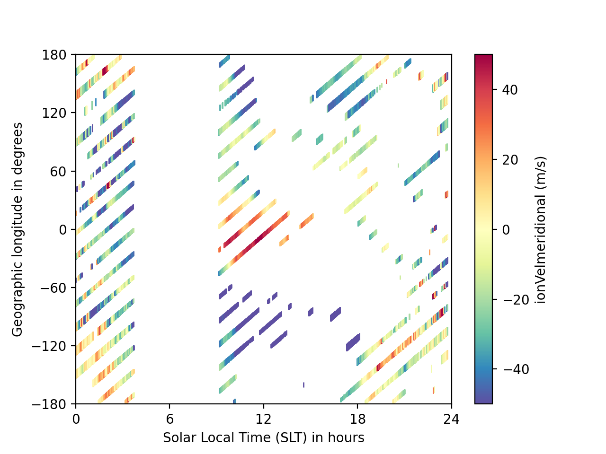

.. _ex_match:

Pair Modelled and Observed Data
===============================

One common analytical need is to obtain a combined data set of modelled and
observed observations at the same times and locations.  This can be done using
the :py:func:`collect_inst_model_pairs` function in :ref:`utils-match`.  This
routine takes a date range as input, and then extracts modelled observations at
the specified instrument location.  However, it does not interpolate in time.
Details about the interpolation of modelled data onto the instrument location
can be found in the :ref:`utils-extract` routine,
:py:func:`extract_modelled_observations`.

.. _ex_match-loc:
    
Match Data by Location
----------------------
    
In the example below, we load a DINEOFs file created for testing purposes and
pair it with C/NOFS IVM data.  This is a global example for a single time,
since in this instance DINEOFs was used to create a day-specific emperical
moodel.  Comparisons with output from a global circulation model would look
different, as one would be more likely to desire the the closest observations
to the model time rather than all observations within the model time.

This example uses the external modules:

#. pysat
#. pysatNASA

Load a test model file from pyDINEOFs. It can be downloaded from the GitHub
repository using the standard :py:meth:`pysat.Instrument.download` method. We
will also set the model-data input keyword arguements that are determined by
the model being used.  The DINEOFs test data applies for an entire day, so the
:py:data:`pair_method` is ``'all'`` and the :py:data:`time_method` is ``'max'``.

::

   import datetime as dt
   from os import path
   import pysat
   import pysatNASA
   import pysatModels as ps_mod

   # Set the instrument inputs
   inst_module = ps_mod.models.pydineof_dineof
   inst_id = ''
   tag = 'test'

   # Initialize the model input information, including the keyword arguements
   # needed to load the model Instrument into an xarray Dataset using
   # the match.load_model_xarray routine
   stime = inst_module._test_dates['']['test']
   tinc = dt.timedelta(days=1)  # Required input is not used in this example
   dineofs = pysat.Instrument(inst_module=inst_module, tag=tag, inst_id=inst_id)

   # If you don't have the test file, download it
   try:
       filename = dineofs.files.files[stime]
   except KeyError:
       dineofs.download(stime, stime)
       filename = dineofs.files.files[stime]

   # Set the input keyword args for the model data
   input_kwargs = {"model_load_kwargs": {'model_inst': dineofs,
                                         'filename': filename},
                   "mod_lon_name": "lon",
                   "mod_name": [None, None, "lon", "lt"],
                   "mod_units": ["km", "deg", "deg", "h"],
                   "mod_datetime_name": "time",
                   "mod_time_name": "time",
		   "model_label": dineofs.name,
		   "pair_method": "all",
		   "time_method": "max",
		   "sel_name": "model_equator_model_data"}

Next, get observational data to match with the model data.  In this example,
we will use C/NOFS-CINDI IVM data, since the DINEOFs test file contains
meridional **E** x **B** drift values.

::
					

   # Initialize the CINDI instrument, and ensure the best model interpolation
   # by extracting the clean data only after matching.
   cindi = pysat.Instrument(inst_module=pysatNASA.instruments.cnofs_ivm,
                            clean_level='none')

   try:
       cindi.files.files[stime]
   except KeyError:
       cindi.download(stime, stime)

   # Set the input keyword args for the CINDI data
   input_kwargs["inst_clean_rout"] = pysatNASA.instruments.cnofs_ivm.clean
   input_kwargs["inst_download_kwargs"] = {"skip_download": True}
   input_kwargs["inst_lon_name"] = "glon"
   input_kwargs["inst_name"] = ["altitude", "alat", "glon", "slt"]

With all of the data obtained and the inputs set, we can pair the data. It
doesn't matter if the longitude range for the model and observational data
use different conventions, as the :py:func:`collect_inst_model_pairs` function
will check for compatibility and adjust the range as needed.

::
   
   matched_inst = ps_mod.utils.match.collect_inst_model_pairs(
       stime, stime + tinc, tinc, cindi, **input_kwargs)

The :py:func:`collect_inst_model_pairs` function returns a
:py:class:`pysat.Instrument` object with the CINDI and DINEOFs data at the
same longitudes and local times. The CINDI data has the same names as the normal
:py:class:`Instrument`. The DINEOFs data has the same name as the normal
:py:class:`Instrument`, but with ``'dineof_'`` as a prefix to prevent confusion.
You can change this prefix using the :py:data:`model_label` keyword argument,
allowing multiple models to be matched to the same observational data set.
   
   
::

   # Using the results from the prior example
   print([var for var in matched_inst.variables
          if var.find(input_kwargs['model_label']) == 0])

This produces the output line: ``['dineof_model_equator_model_data']``.

To see what the matched data looks like, let's create a plot that shows the
locations and magnitudes of the modelled and measured meridional **E** x **B**
drifts.  We aren't directly comparing the values, since the test file is filled
with randomly generated values that aren't realistic.

::
   
   import matplotlib as mpl

   # Initialize the figure
   fig = plt.figure()
   ax = fig.add_subplot(111)

   # Plot the data
   ckey = 'ionVelmeridional'
   dkey = 'dineof_model_equator_model_data'
   vmax = 50
   con = ax.scatter(matched_inst['slt'], matched_inst['glon'],
                    c=matched_inst[ckey], s=matched_inst[dkey].abs() * 10 + 10,
                    marker='|', vmin=-vmax, vmax=vmax, lw=1,
                    cmap=mpl.cm.get_cmap('Spectral_r'))
   cb = mpl.pyplot.colorbar(con, ax=ax)

   # Format the figure
   ax.xaxis.set_major_locator(mpl.ticker.MultipleLocator(6))
   ax.yaxis.set_major_locator(mpl.ticker.MultipleLocator(60))
   ax.set_xlabel(matched_inst.meta['slt', matched_inst.meta.labels.desc])
   ax.set_ylabel(matched_inst.meta['glon', matched_inst.meta.labels.desc])
   ax.set_xlim(0, 24)
   ax.set_ylim(-180, 180)
   cb_label = "{:s} ({:s})".format(
       matched_inst.meta[ckey, matched_inst.meta.labels.name],
       matched_inst.meta[vkey, matched_inst.meta.labels.units])
   cb.set_label(cb_label)

.. _ex_match-loc-time:
    
Match Data by Location and Time
-------------------------------

For models with Universal Time variations over the desired period, you can also
match model and data results by both time and location.  This is done by
setting the :py:data:`time_method` keyword arguement to ``'min'``.
